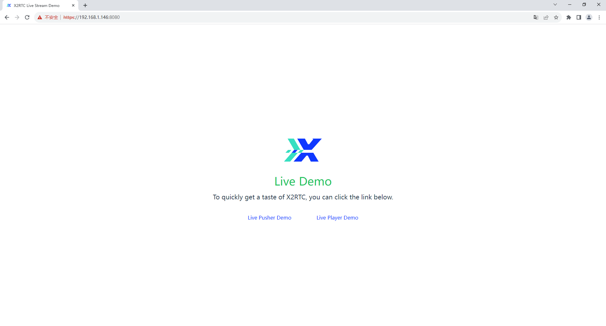
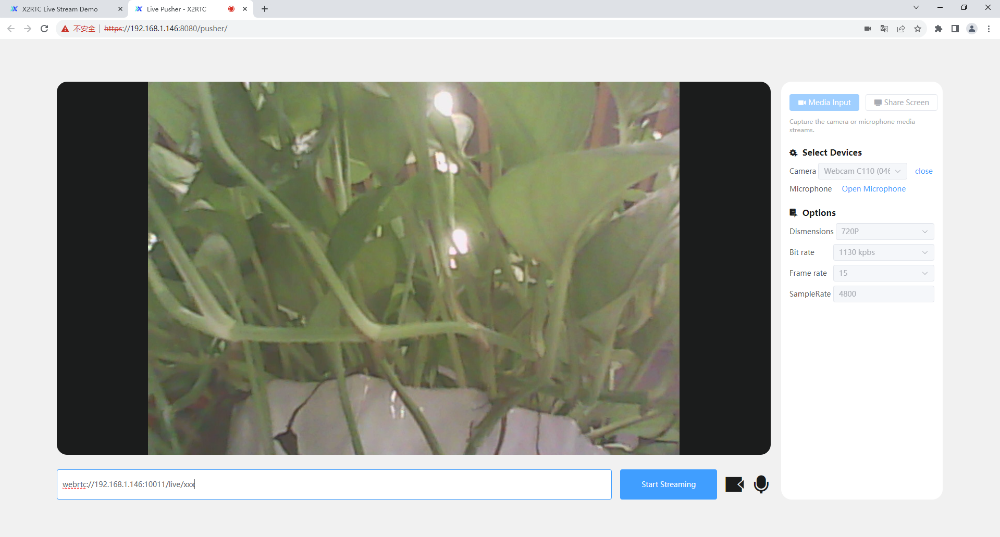
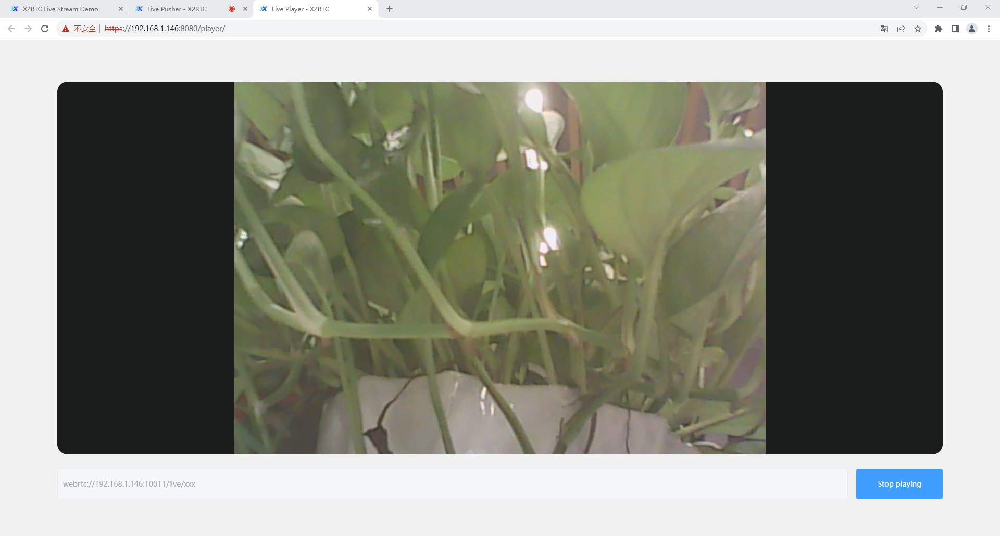

# X2Rtc-Stream

[![][x2rtc-banner]][x2rtc-website]

## Website and Documentation

* [x2rtc.com][x2rtc-website]

## Design Goals

x2rtc is designed to accomplish with the following goals:

* Be a powerful [SFU](https://webrtcglossary.com/sfu/) (Selective Forwarding Unit).
* Support all live stream like: rtmp, srt, flv, rtp, webrtc etc.
* Be simple, low level API for easy use.
* Layered architecture: Network; ProtocolHandler; MediaHandler; MediaDispatch.
* Support WebRtc whep/whip signaling protocol.
* Extremely powerful (Support multi-thread coded in C++ ).
* Super fast ,stable and useful are our ultimate goal!

## How to Install?

1、Download  X2RtcStream

```
git clone https://github.com/X2Rtc/X2Rtc-Stream.git
```

2、Compile X2RtcStream

```
cd X2Rtc-Stream
sh make.sh all
```

3、Start X2RtcStream

```
sh x2rtc.sh start
```

`End Install`

4、Other parameters

```
## Multiple cpu installation 
sh make.sh all -j4

## Uninstall X2RtcStream service
sh make.sh all clean

## Stop X2RtcStream service
sh x2rtc.sh stop

## Restart X2RtcStream service
sh x2rtc.sh restart
```

## How to use Demo?

1、Use the address obtained by running sh x2rtc.sh start

Warn：`Check sh x2rtc.sh start print information`

Warn：`Test the Demo using an accessible IP`

```
Starting Dync Server(X2RtcStream):                         [  确定  ]
##############################################
#    X2Rtc: Stream Server (1.0.2_20220914_01)
# 
#    Authed by X2Rtc-Team
#    Website: https://www.x2rtc.com
##############################################

X2NetWebRtcProcess.cpp: Line 215:	pipe Create Pair ConsumerChannelFd[0]=19 ConsumerChannelFd[1]=20 
X2NetWebRtcProcess.cpp: Line 217:	pipe Create Pair ProducerChannelFd[0]=23 ProducerChannelFd[1]=24 
[X2Rtc] Init ssl server OK!
********************************************************************************* 
warn: External address please map the port or open the firewall... 
*********************************************************************************
Web platform External address：https://127.0.0.1:8080 
Web platform Internal address：https://192.168.1.146:8080
WebRTC External push-pull address：webrtc://127.0.0.1:10011/live/xxx
WebRTC Internal push-pull address：webrtc://192.168.1.146:10011/live/xxx
*********************************************************************************
```

2、Login Web Platform Demo

Warn：`Use sh x2rtx.sh start to print the Web platform address`

Warn：`Use Live Pusher Demo to Pusher the stream`

Warn：`Use Live Player Demo to Player the stream`



3、Live Pusher Demo Example

Warn：`Use sh x2rtx.sh start to print the Pusher address`

Warn：`Please turn on the camera first...`

Warn：`Fill in the Pusher address and click Start `



4、Live Player Demo Example

Warn：`Use sh x2rtx.sh start to print the Player address`

Warn：`Fill in the Player address and click Start`



## Dependencies

To use it, you'll need to satisfy the following dependencies, and must to comply with the licensing agreement of each project:

- [abseil-cpp](https://github.com/abseil-cpp)
- [faac](https://github.com/faac)
- [faad](https://github.com/faad)
- [HttpParser](https://github.com/)
- [jsoncpp](https://github.com/)
- [jthread](https://github.com/)
- [mediaserver](https://github.com/)
- [srtp](https://github.com/)
- [libuv](https://github.com/)
- [MediaSoup](https://github.com/)
- [openssl](https://github.com/)
- [opus](https://github.com/)
- [rapidjson](https://github.com/)
- [spdlog](https://github.com/)
- [srt](https://github.com/)
- [usrsctp](https://github.com/)
- [WsSocket](https://github.com/)
- [ZlMediaKit](https://github.com/) 
- [ZlToolKit](https://github.com/)
- [WebRtc](https://github.com/)

## Social

* Twitter: [@X2rtc_cloud](https://twitter.com/X2rtc_cloud)

## License

GUN License - see [LICENSE](https://github.com/X2Rtc/X2Rtc-Stream/blob/master/LICENSE) for full text

[x2rtc-website]: x2rtc
[x2rtc-banner]: /art/x2rtc-banner.png
